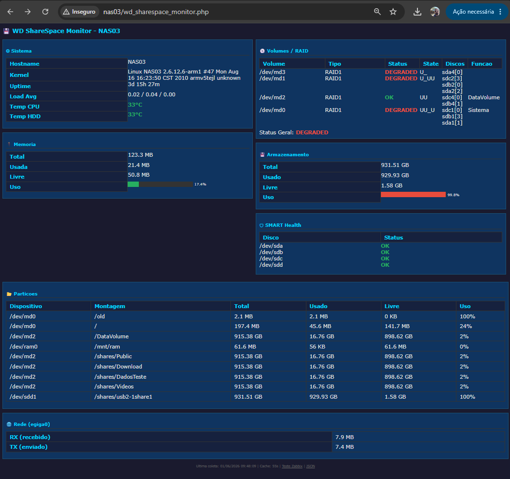

# 💾 WD ShareSpace Monitor

> Ferramenta de monitoramento em tempo real para o NAS WD ShareSpace — dispositivo legado com kernel ARM 2.6.12.6 e PHP 4.4.2.

  

---

## 🇧🇷 Português

### Sobre o Projeto

O **WD ShareSpace** é um NAS (Network Attached Storage) antigo que não possui suporte oficial a agentes de monitoramento modernos. Este projeto oferece uma solução leve e compatível para monitorar o dispositivo em tempo real diretamente pelo navegador, além de integração com o **Zabbix** via HTTP Agent.

### Arquivos

| Arquivo | Descrição |
|---|---|
| `wd_sharespace_monitor.php` | Página de monitoramento em tempo real (interface web + endpoint Zabbix/JSON) |
| `zabbix_template_wd_sharespace.yaml` | Template Zabbix 7.0 com itens, triggers e alertas pré-configurados |

### O que é monitorado

- **Sistema** — Hostname, Kernel, Uptime, Load Average, Temperatura CPU e HDD
- **Memória** — Total, Usada, Livre e percentual de uso (com barra visual)
- **Volumes / RAID** — Status de cada volume md (RAID0/1/5/10/JBOD), estado dos discos membros e detecção de rebuild
- **Armazenamento** — Espaço total, usado e livre do volume principal (com barra visual)
- **SMART Health** — Status de saúde de cada disco físico (sda, sdb, sdc, sdd)
- **Partições** — Listagem completa de todos os pontos de montagem com uso detalhado
- **Rede** — Bytes recebidos (RX) e enviados (TX) pela interface principal

A página atualiza automaticamente a cada **60 segundos** e mantém cache local de **55 segundos** para não sobrecarregar o hardware limitado do dispositivo.

### Pré-requisitos

- Acesso administrativo ao painel web do WD ShareSpace
- Acesso SSH/SCP habilitado no dispositivo
- Cliente SSH/SCP no computador (ex: `ssh`, `scp`, PuTTY, WinSCP)

### Instalação

**1. Habilitar o acesso SSH no painel da Storage**

Acesse o painel de administração do WD ShareSpace via navegador e habilite o acesso SSH nas configurações de administrador.

**2. Conectar via SSH**

```bash
ssh root@<IP_DA_STORAGE>
```

> Credenciais padrão de fábrica:
> - **Usuário:** `root`
> - **Senha:** `welc0me`

**3. Copiar os arquivos para a Storage**

Em outro terminal (na sua máquina local), use SCP para transferir os arquivos:

```bash
scp wd_sharespace_monitor.php root@<IP_DA_STORAGE>:/proto/SxM_webui/
scp zabbix_template_wd_sharespace.yaml root@<IP_DA_STORAGE>:/proto/SxM_webui/
```

**4. Ajustar as permissões dos arquivos**

De volta ao terminal SSH na Storage:

```bash
chmod a+x /proto/SxM_webui/wd_sharespace_monitor.php
chmod a+x /proto/SxM_webui/zabbix_template_wd_sharespace.yaml
```

> ⚠️ O servidor web interno (`mini_httpd`) executa arquivos `.php` como CGI. O bit de execução é obrigatório para o funcionamento correto.

**5. Acessar pelo navegador**

```
http://<IP_DA_STORAGE>/wd_sharespace_monitor.php
```

### Integração com o Zabbix

O arquivo PHP expõe endpoints específicos para o Zabbix via parâmetro `mode=zabbix`:

```
http://<IP_DA_STORAGE>/wd_sharespace_monitor.php?mode=zabbix&metric=<METRICA>
```

**Métricas disponíveis:**

| Métrica | Descrição |
|---|---|
| `uptime` | Uptime em segundos |
| `load1` / `load5` / `load15` | Load Average (1, 5 e 15 minutos) |
| `mem_total` / `mem_used` / `mem_free` | Memória em KB |
| `mem_percent` | Uso de memória em % |
| `disk_total` / `disk_used` / `disk_free` | Disco em KB |
| `disk_percent` | Uso de disco em % |
| `raid_status` | Status geral dos volumes RAID |
| `raid_md0_status` / `raid_md2_status` | Status individual por volume |
| `temp_cpu` / `temp_hdd` | Temperatura em °C |
| `net_rx_bytes` / `net_tx_bytes` | Tráfego de rede em bytes |
| `disk_health_sda` ... `disk_health_sdd` | Status SMART por disco |

**Importar o template no Zabbix:**

1. Acesse **Configuration → Templates → Import**
2. Selecione o arquivo `zabbix_template_wd_sharespace.yaml`
3. Confirme a importação
4. Vincule o template ao host do WD ShareSpace (use o IP como `{HOST.CONN}`)

O template inclui triggers pré-configuradas para alertas de:
- Storage offline (sem dados por 5 minutos) — **HIGH**
- Load Average alto — **WARNING**
- Temperatura CPU acima de 70°C — **AVERAGE**
- Memória acima de 90% — **AVERAGE**
- Disco acima de 80% — **WARNING**
- Disco acima de 90% — **HIGH**
- Status RAID degradado — **HIGH**
- Falha SMART em qualquer disco — **HIGH**

### Saída JSON

Para obter todos os dados coletados em formato JSON:

```
http://<IP_DA_STORAGE>/wd_sharespace_monitor.php?mode=json
```

### Observações Técnicas

- O script foi desenvolvido para ser compatível com **PHP 4.4.2** (sem funções modernas)
- O servidor web `mini_httpd` requer que os headers HTTP sejam emitidos manualmente
- O PATH do ambiente CGI é limitado; o script força `/usr/local/sbin:/usr/sbin:/usr/bin:/sbin:/bin`
- O cache de 55 segundos é armazenado em `/tmp/wd_monitor_cache.dat`

---

## 🇺🇸 English

### About the Project

The **WD ShareSpace** is a legacy NAS (Network Attached Storage) device with no official support for modern monitoring agents. This project provides a lightweight, fully compatible solution to monitor the device in real time via a web browser, along with **Zabbix** integration via HTTP Agent.

### Files

| File | Description |
|---|---|
| `wd_sharespace_monitor.php` | Real-time monitoring page (web interface + Zabbix/JSON endpoint) |
| `zabbix_template_wd_sharespace.yaml` | Zabbix 7.0 template with pre-configured items, triggers and alerts |

### What is monitored

- **System** — Hostname, Kernel, Uptime, Load Average, CPU and HDD temperature
- **Memory** — Total, Used, Free and usage percentage (with visual bar)
- **Volumes / RAID** — Status of each md volume (RAID0/1/5/10/JBOD), member disk states and rebuild detection
- **Storage** — Total, used and free space on the main volume (with visual bar)
- **SMART Health** — Health status of each physical disk (sda, sdb, sdc, sdd)
- **Partitions** — Full listing of all mount points with detailed usage
- **Network** — Bytes received (RX) and transmitted (TX) on the primary interface

The page auto-refreshes every **60 seconds** and keeps a local cache of **55 seconds** to avoid overloading the device's limited hardware.

### Prerequisites

- Administrative access to the WD ShareSpace web panel
- SSH/SCP access enabled on the device
- An SSH/SCP client on your computer (e.g. `ssh`, `scp`, PuTTY, WinSCP)

### Installation

**1. Enable SSH access on the Storage panel**

Log in to the WD ShareSpace administration panel via browser and enable SSH access under the administrator settings.

**2. Connect via SSH**

```bash
ssh root@<STORAGE_IP>
```

> Default factory credentials:
> - **User:** `root`
> - **Password:** `welc0me`

**3. Copy the files to the Storage**

In another terminal (on your local machine), use SCP to transfer the files:

```bash
scp wd_sharespace_monitor.php root@<STORAGE_IP>:/proto/SxM_webui/
scp zabbix_template_wd_sharespace.yaml root@<STORAGE_IP>:/proto/SxM_webui/
```

**4. Set file permissions**

Back in the SSH terminal on the Storage:

```bash
chmod a+x /proto/SxM_webui/wd_sharespace_monitor.php
chmod a+x /proto/SxM_webui/zabbix_template_wd_sharespace.yaml
```

> ⚠️ The internal web server (`mini_httpd`) executes `.php` files as CGI scripts. The execute bit is required for correct operation.

**5. Access via browser**

```
http://<STORAGE_IP>/wd_sharespace_monitor.php
```

### Zabbix Integration

The PHP file exposes specific endpoints for Zabbix via the `mode=zabbix` parameter:

```
http://<STORAGE_IP>/wd_sharespace_monitor.php?mode=zabbix&metric=<METRIC>
```

**Available metrics:**

| Metric | Description |
|---|---|
| `uptime` | Uptime in seconds |
| `load1` / `load5` / `load15` | Load Average (1, 5 and 15 minutes) |
| `mem_total` / `mem_used` / `mem_free` | Memory in KB |
| `mem_percent` | Memory usage in % |
| `disk_total` / `disk_used` / `disk_free` | Disk space in KB |
| `disk_percent` | Disk usage in % |
| `raid_status` | Overall RAID volume status |
| `raid_md0_status` / `raid_md2_status` | Per-volume status |
| `temp_cpu` / `temp_hdd` | Temperature in °C |
| `net_rx_bytes` / `net_tx_bytes` | Network traffic in bytes |
| `disk_health_sda` ... `disk_health_sdd` | SMART status per disk |

**Import the template into Zabbix:**

1. Go to **Configuration → Templates → Import**
2. Select the `zabbix_template_wd_sharespace.yaml` file
3. Confirm the import
4. Link the template to the WD ShareSpace host (use the device IP as `{HOST.CONN}`)

The template includes pre-configured triggers for:
- Storage offline (no data for 5 minutes) — **HIGH**
- High Load Average — **WARNING**
- CPU temperature above 70°C — **AVERAGE**
- Memory above 90% — **AVERAGE**
- Disk above 80% — **WARNING**
- Disk above 90% — **HIGH**
- Degraded RAID status — **HIGH**
- SMART failure on any disk — **HIGH**

### JSON Output

To get all collected data in JSON format:

```
http://<STORAGE_IP>/wd_sharespace_monitor.php?mode=json
```

### Technical Notes

- The script was written for compatibility with **PHP 4.4.2** (no modern functions used)
- The `mini_httpd` web server requires HTTP headers to be emitted manually
- The CGI environment has a restricted PATH; the script forces `/usr/local/sbin:/usr/sbin:/usr/bin:/sbin:/bin`
- The 55-second cache is stored at `/tmp/wd_monitor_cache.dat`

---

### Example screen


---
## License

MIT License — feel free to use, modify and share.
